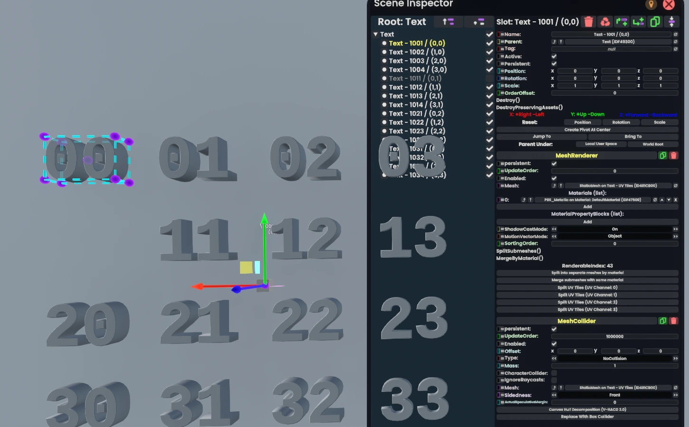

# RMLModTemplate
[](https://github.com/mpmxyz/RMLModTemplate/actions/workflows/build-release.yml) [](https://github.com/mpmxyz/RMLModTemplate/actions/workflows/check-for-resonite-updates.yml)

This is a simple template to develop mods for [Resonite](https://resonite.com/) using [Resonite Mod Loader](https://github.com/resonite-modding-group/ResoniteModLoader) (RML).

It incorporates learnings from [a previous template](https://github.com/mpmxyz/ResoniteSampleMod):
- It focuses on a single mod loader. (RML because MonkeyLoader can load RML mods but not the other way around.)
- Github workflows are kept at a minimum. Instead it uses shell scripts that can also be run locally for testing.
- No Steam login is necessary. It is expected that the user updates a fork of [mpmxyz/ResoniteAssemblies](https://github.com/mpmxyz/ResoniteAssemblies) from their local machine.
  - This is as simple as:
    ```
    .\make.bat OR ./make.sh
    git add *
    git commit -m 'whatever'
    git push
    ```
  - The project uses a local Resonite install when the environment variable `ResonitePath` is set.
- CI/CD is simplified so that a simple push to main will publish a new release.
- The release version number is now dictated from the code.
  - You cannot mismatch or accidentally release a duplicate version number!
- A build for a new Resonite version is automatically triggered at most 3 hours after it has been pushed to the fork of [mpmxyz/ResoniteAssemblies](https://github.com/mpmxyz/ResoniteAssemblies).

## How to get started
1. [Create a repository](https://github.com/new?template_name=RMLModTemplate&template_owner=mpmxyz) with this as a template!
2. Clone the repository!
3. Ensure the enviroment variable `ResonitePath` points to the Resonite install directory!
4. Run `setup-template-names.sh` to edit author and mod names!
5. Start coding!
6. A fork of [mpmxyz/ResoniteAssemblies](https://github.com/mpmxyz/ResoniteAssemblies) is required to publish releases.

## How to publish a release
1. Ensure you have incremented the version number in `TODO_TemplateModName.VERSION_CONSTANT`!
2. Push/merge your changes into the `main` branch on GitHub!
3. Wait until the workflow `build-release` finished successfully!
4. Your new version has been released. Edit the release notes to explain your changes!

## How to rebuild for a new Resonite version
1. [Update the fork](https://github.com/mpmxyz/ResoniteAssemblies/blob/main/README.md#update-workflow) of `mpmxyz/ResoniteAssemblies`!
2. Either
   - Either wait until the workflow [`check-for-resonite-updates`](.github/workflows/check-for-resonite-updates.yml) runs automatically (max. 3 hours)
   - or [trigger it manually](https://github.com/TODO_TemplateAuthor/TODO_TemplateModName/actions/workflows/check-for-resonite-updates.yml).

## The following section can be used as a base for your own README.md:

# TODO_TemplateModName

[](https://github.com/TODO_TemplateAuthor/TODO_TemplateModName/actions/workflows/build-release.yml) [](https://github.com/TODO_TemplateAuthor/TODO_TemplateModName/actions/workflows/check-for-resonite-updates.yml)

TODO: The pitch - why should one need this mod?

## Installation
1. Install [ResoniteModLoader](https://github.com/resonite-modding-group/ResoniteModLoader)!
1. Place [TODO_TemplateModName.dll](https://github.com/TODO_TemplateAuthor/TODO_TemplateModName/releases/latest/download/TODO_TemplateModName.dll) into your `rml_mods` folder! This folder should be at `C:\Program Files (x86)\Steam\steamapps\common\Resonite\rml_mods` for a default install. You can create it if it's missing, or if you launch the game once with ResoniteModLoader installed it will create this folder for you.
1. Start the game! If you want to verify that the mod is working you can check your Resonite logs.
1. TODO: Add extra steps if necessary!

## Usage / Screenshots
1. TODO: Explain how the mod is used!
1. TODO: Add visual examples so readers understand without running the mod!

